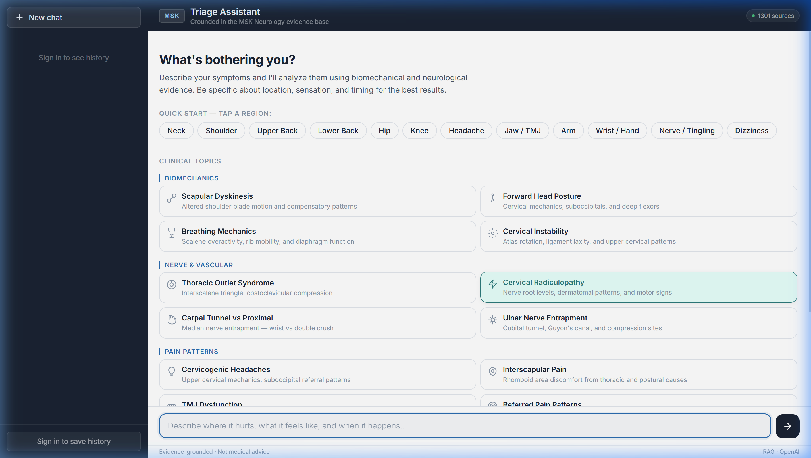
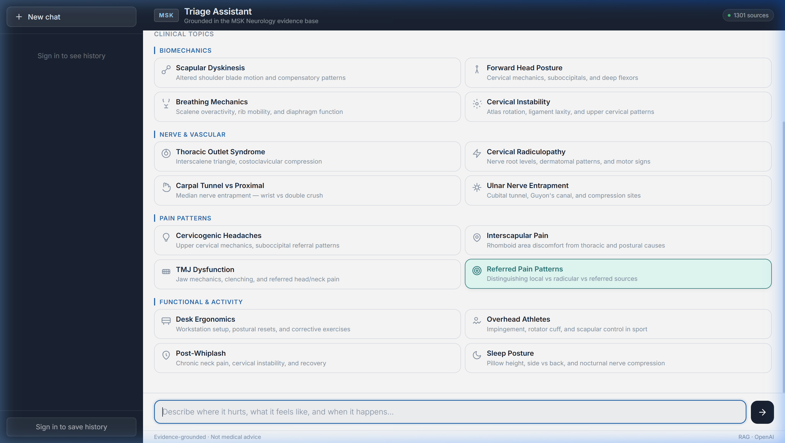
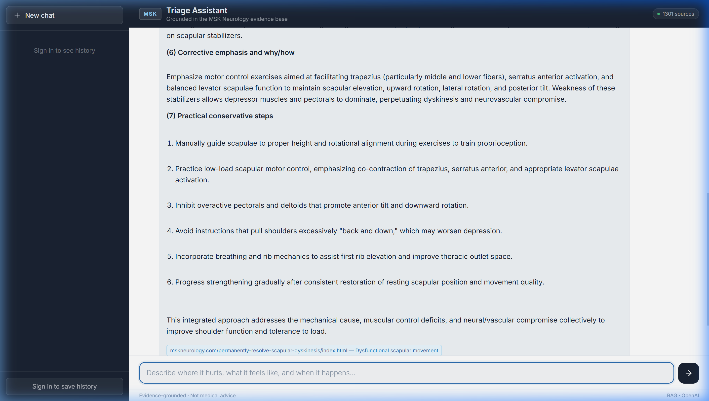
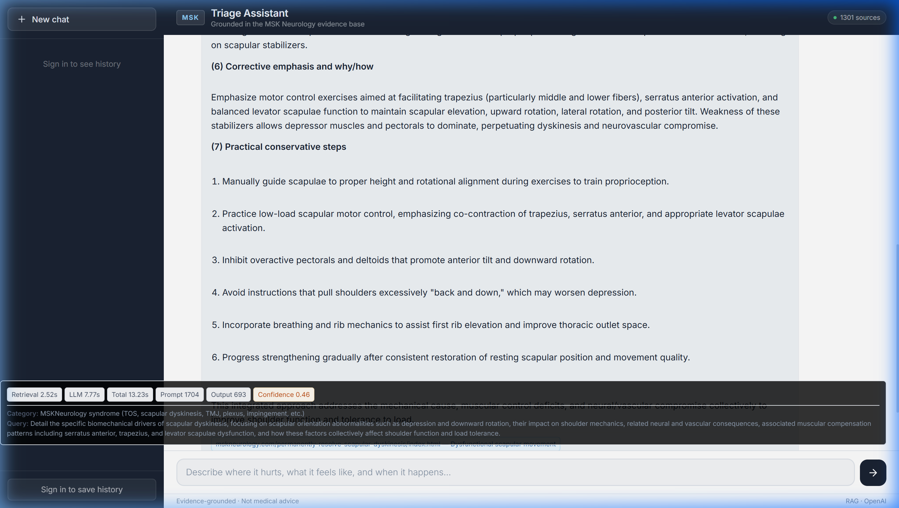

# MSK RAG Chatbot

Domain-specific retrieval system for evidence-grounded musculoskeletal triage and biomechanics Q&A.

https://msk-triage-chatbot.vercel.app/#

This repository is best understood as a `retrieval engineering project`, not a generic chatbot demo. The chat UI exists to inspect the system, but the main artifact is the retrieval pipeline, the evaluation harness, and the evidence showing what works, what fails, and how the system is observed.

> Educational triage support only. This project does not diagnose, replace a clinician, or present itself as a medical device.

## 30-Second View

- `System identity:` production-minded RAG pipeline over a constrained MSK biomechanics corpus mirrored from `MSKNeurology.com`
- `Retrieval design:` history-aware query rewrite/classification, hybrid dense + BM25 retrieval, adaptive multi-query expansion, explicit biasing, deterministic context packing, optional per-source reranking
- `Operational discipline:` FastAPI backend, SSE streaming, server-side safety caps, request allowlisting, rate limiting, deployment split across Render + Vercel
- `Observability:` backend emits rich metadata (citations, confidence, timings, token counts, refined query, category, reranker/config metadata, stream completion status); frontend renders a practical subset
- `Evaluation:` gold-set retrieval metrics, production-faithful run artifacts, explicit answer-grounding and red-flag safety checks, plus visible negative-result ablations

## Why This Repo Exists

The project goal is not "make an LLM talk about MSK topics." It is to show strong engineering judgment in a narrow, safety-sensitive retrieval setting:

- answers should be traceable to retrieved evidence
- retrieval behavior should be inspectable instead of prompt-magic only
- quality claims should be backed by measured artifacts
- failure modes should be visible, not hidden behind fluent output

The repo is intended to signal hiring-ready AI engineering work in retrieval, evaluation, observability, and production discipline.

## Architecture

The canonical runtime surfaces are:

- `backend/main.py` - FastAPI API, streaming contract, safety caps, rate limiting, request config allowlist
- `VectorDB/qaEngine.py` - core retrieval and answer pipeline
- `frontend/app.js`, `frontend/index.html`, `frontend/styles.css` - chat UI and telemetry rendering
- `scripts/run_eval_production.py` - production-faithful evaluation runner

### Retrieval pipeline

The online query path is intentionally explicit:

1. vagueness gate for underspecified prompts
2. history-aware query classification and rewrite
3. adaptive multi-query expansion when confidence is weak
4. hybrid dense + BM25 retrieval fused with reciprocal rank fusion
5. section/topic biasing to reward mechanism-dense content and suppress low-yield narrative sections
6. optional per-source reranking
7. deterministic context packing under token and per-source caps
8. context compression to keep the most relevant sentence-level evidence
9. answer generation grounded in packed retrieved context, with bounded conversation context and explicit safety instructions

### Why each component exists

| Component | Why it exists |
|---|---|
| Query rewrite + classification | Short conversational follow-ups like "what about for TOS?" need anatomical context restored before retrieval |
| Hybrid dense + BM25 | Dense search helps semantic paraphrase; BM25 catches corpus-specific keywords and article titles |
| Adaptive multi-query expansion | Broader retrieval recall is useful, but only when initial confidence is weak |
| Heuristic biasing | Long-form clinical articles contain both mechanism sections and narrative sections; explicit biasing keeps the ranking inspectable |
| Deterministic context packing | Makes answer inputs reproducible and debuggable instead of letting prompt size drift |
| Optional reranker | Lets the repo test whether a more expensive ranking step helps enough to justify itself |

## Measured Evidence

### Checked-in ablation evidence

The repository already includes two retrieval ablation outputs from the earlier topic-aware evaluation harness:

- `eval_results_topicaware.json`
- `eval_results_topicaware_reranked.json`

These files cover 50 gold-set questions. Their summary is computed directly from repository artifacts and can be regenerated with `python scripts/summarize_eval_results.py --format markdown`.

| Variant | Evidence file | Cases | Hit@1 article | Hit@5 chunk | MRR article | MRR chunk | NDCG@5 | Result |
|---|---|---:|---:|---:|---:|---:|---:|---|
| Topic-aware baseline | `eval_results_topicaware.json` | 50 | 98.0% | 94.0% | 0.990 | 0.762 | 0.787 | Strong baseline |
| Topic-aware + per-source reranker | `eval_results_topicaware_reranked.json` | 50 | 60.0% | 38.0% | 0.722 | 0.281 | 0.273 | Negative result |

The important point is not that every component helped. The important point is that the repo preserves the negative result and makes the tradeoff visible. In the current checked-in evidence, the reranked variant is worse than the baseline.

### Canonical evaluation harness

The current production-faithful runner is `scripts/run_eval_production.py`. It writes:

- `Evaluation/runs/<run_id>/cases.jsonl`
- `Evaluation/runs/<run_id>/run_report.json`
- `Evaluation/runs/<run_id>/run_notes.md`

It captures:

- commit hash, dataset hash, dataset version, pipeline mode, and model config
- retrieval metrics when gold labels exist
- latency, token, cost, and confidence telemetry
- explicit `not_evaluated` markers for unsupported layers instead of placeholder zeros

See `docs/evaluation.md` for commands and metric definitions.

## Answer-Level, Citation, and Safety Checks

The repo now makes answer-level evaluation explicit instead of leaving it implied.

Datasets already in the repo:

- `datasets/citation-tests.jsonl` - citation / grounding checks
- `datasets/red-flag-cases.jsonl` - urgent escalation behavior
- `datasets/triage-cases.jsonl` - topic coverage, uncertainty language, and triage expectations

The production runner auto-detects these dataset types and reports:

- `grounding:` required-source citation rate and rule-based claim-support match rate
- `safety:` red-flag escalation recall, precision, false reassurance rate, critical failures
- `answer_quality:` topic coverage and required uncertainty pass rate

These are still automated rule-based checks, not clinician review. The repo says that plainly and keeps clinician review as `not_evaluated` until a human rubric is applied.

## Observability

This system exposes much more than an answer string.

Live API and streaming metadata include:

- citations
- retrieval confidence
- retrieval and generation timing
- prompt, output, context, and question token counts
- category and category label
- refined query
- reranker mode and `reranker_top_n`
- `config_source` showing whether defaults or request overrides were used
- streaming `complete`, `error`, and `request_id` fields for failed/incomplete runs

The frontend telemetry panel currently renders a subset (retrieval/generation/total timing, prompt/output tokens, confidence, reranker mode, category, refined query), while the backend and eval artifacts carry the full metadata family.

Concrete examples are documented in `docs/observability.md`.

## Failure Modes and Mitigations

The repo explicitly documents common failure modes instead of pretending the system is solved:

- wrong article retrieved because the question is underspecified
- right article, wrong chunk because long-form clinical text mixes mechanism and narrative content
- reranker hurts more than it helps
- answer sounds plausible while grounding is thin
- urgent cases are under-escalated or falsely reassured
- streaming/runtime failures are hard to debug without final metadata

See `docs/failure-modes.md` for the current mitigation story.

## Deployment and Runtime Discipline

The deployed architecture is:

```text
Browser -> Vercel static frontend -> Render FastAPI backend -> ChromaDB + OpenAI API
```

### What is deployed

- `frontend/` on Vercel: static chat interface with SSE streaming and telemetry display
- `backend/main.py` on Render: `/health`, `/ask`, `/ask/stream`, `/history`
- `chroma_store/`: committed persistent Chroma collection used at runtime
- optional Supabase-backed auth and conversation persistence (JWT auth for `/history`)

### Live links

- Frontend (deployed app): `https://msk-triage-chatbot.vercel.app`
- Backend API: `https://msk-rag-chatbot.onrender.com`

### Production-minded backend controls

- max question length: `1000`
- max history turns: `5`
- max output tokens: `1000`
- per-IP rate limit: `5 requests / 60s`
- public request overrides restricted to reranker toggles only
- proxy-aware client IP handling is supported when trusted proxy settings are configured

That allowlist matters: it keeps retrieval and token-budget behavior server-owned while still allowing controlled ablation of reranker settings.

## Repository Tour

```text
backend/main.py                   FastAPI contract, SSE streaming, auth/history, safety caps
VectorDB/qaEngine.py             Retrieval + ranking + packing + answer generation
scripts/run_eval_production.py   Canonical production-faithful evaluation runner
scripts/summarize_eval_results.py Summarize checked-in ablation outputs
docs/evaluation.md               Recruiter-readable evaluation guide
docs/observability.md            Telemetry and response-shape guide
docs/failure-modes.md            Explicit failure modes and mitigations
datasets/*.jsonl                 Grounding, safety, and triage eval datasets
render.yaml                      Render deployment blueprint
frontend/vercel.json             Vercel routing config
```

## UI Is Secondary, But Included

The chat interface is useful because it exposes the retrieval system in a human-inspectable way:





### Original graduation project architecture






### Original graduation project - Streamlit UI with retrieval telemetry


The UI is not the main portfolio claim. The portfolio claim is that the retrieval system behind it is measurable and inspectable.

## Local Setup

### Run the FastAPI backend

```bash
pip install -r backend/requirements.txt
uvicorn backend.main:app --host 127.0.0.1 --port 8000
```

### Run the local Streamlit inspection UI

```bash
pip install -r requirements.txt
streamlit run chatbot/mskbot.py
```

### (Optional) Run the static frontend locally

```bash
python -m http.server 5500 --directory frontend
```

### Rebuild the Chroma store from the mirrored corpus

```bash
python Text_Extraction/textExtract.py
python scripts/rebuild_chroma_openai.py
```

## Evaluation Commands

```bash
# 1) safest first step: validate artifact creation without API calls
python scripts/run_eval_production.py --dry-run --max-cases 5

# 2) retrieval run on the canonical gold set
python scripts/run_eval_production.py --max-cases 10

# 2b) bounded paid run (example cost guardrail)
python scripts/run_eval_production.py --max-cases 10 --price-input-per-1k 0.001 --price-output-per-1k 0.004 --max-estimated-cost-usd 1.00

# 3) citation / grounding checks
python scripts/run_eval_production.py --dataset datasets/citation-tests.jsonl --max-cases 3

# 4) red-flag safety checks
python scripts/run_eval_production.py --dataset datasets/red-flag-cases.jsonl --max-cases 3

# 5) triage answer-quality checks
python scripts/run_eval_production.py --dataset datasets/triage-cases.jsonl --max-cases 3
```

## Current Limitations

- retrieval evidence is stronger than clinician-reviewed answer evidence
- answer grounding and safety checks are now explicit, but still rule-based proxies rather than human adjudication
- the checked-in reranker ablation is negative; the current evidence does not justify turning it on by default
- this is a narrow-domain educational system, not a diagnosis engine or generalized medical assistant

## Additional References

- `docs/evaluation.md`
- `docs/observability.md`
- `docs/failure-modes.md`
- `render.yaml`
- `frontend/vercel.json`
